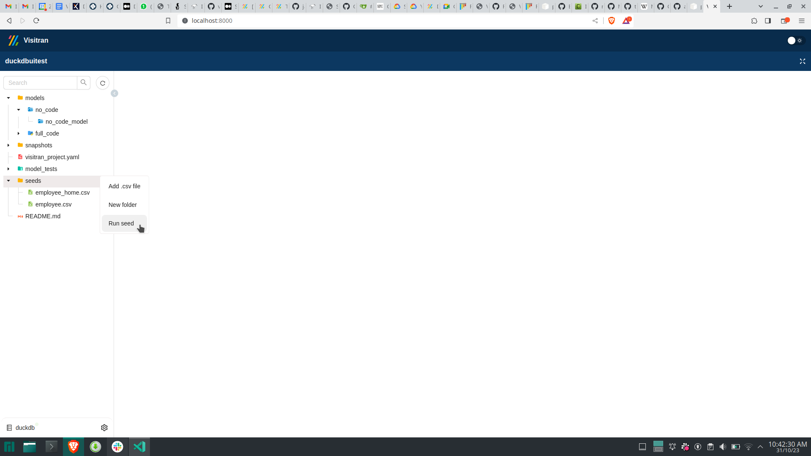
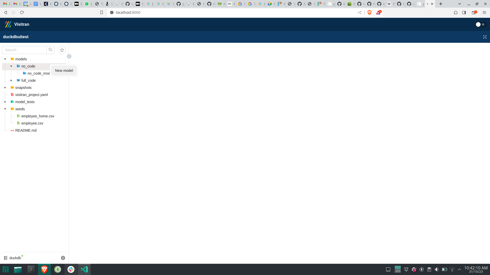
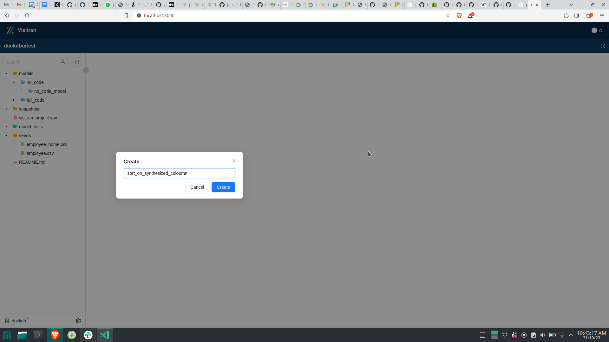
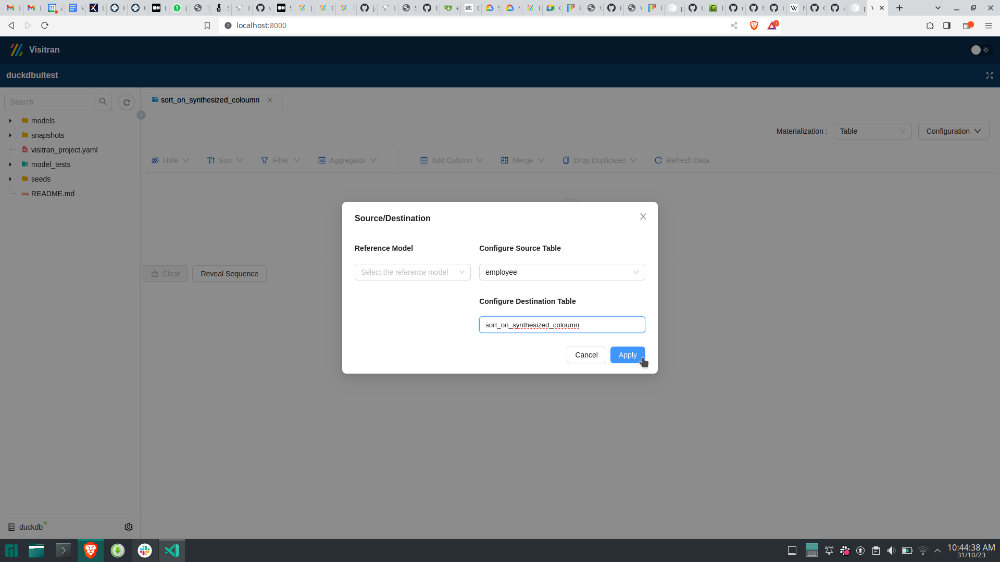
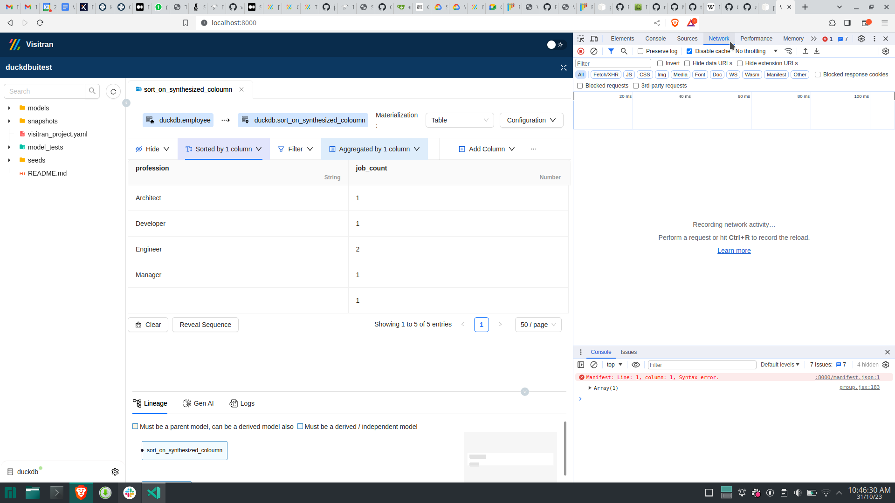
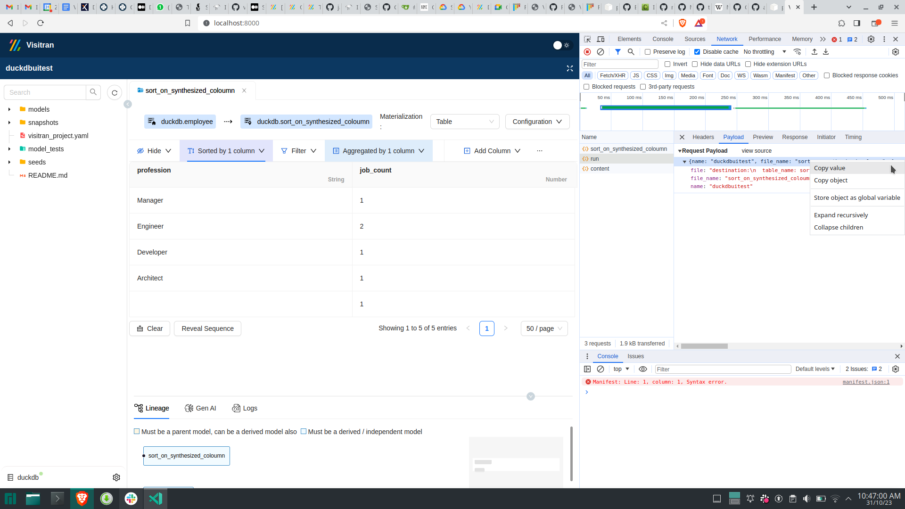
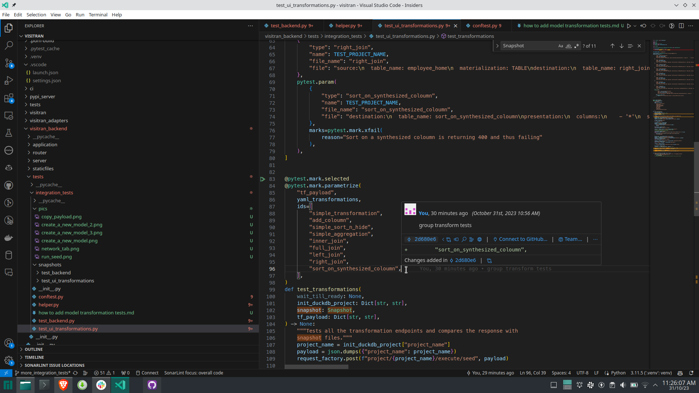

# Backend Server Testing

## Running Existing Tests for `visitran_backend`

1. To run the pre-existing tests for `visitran_backend`, navigate to the project directory, activate the virtual environment,and
execute the following commands:

    ```bash
    cd backend/
    uv run pytest -x -vv
    ```

    This will run all the backend-related tests.

2. To debug the backend tests in `VSCode`, use `Ctrl+Shift+P` and select
`Python: Configure tests`, then choose the `visitran_backend` directory.

## Adding New Tests

You can add a new test as shown below:

```python
def test_some_feature(wait_till_ready: None) -> None:
    pass
```

The `wait_till_ready` fixture ensures that a Visitran DuckDB project is initialized with some dummy CSV files in the seeds folder
and that the Django backend server is started and ready to serve requests by the time the execution reaches the `pass` statement
in the above code.

The following points describe what each of the fixtures does in order:

* `create_project_profile_paths`: This fixture creates temporary profile and project directories during the setup phase and
deletes these folders in the teardown phase.

* `init_duckdb_project`: This fixture calls Visitran init using the `subprocess` module and initializes a DuckDB project named
`duckdbuitest` in the path created in the previous step.

* `generate_employee_csv_file`: This fixture adds some dummy CSV files on which we will later run our tests. More CSV files
can be added if required.

* `start_backend_server`: This fixture function creates a `cache.yaml` file, which is later used by the backend to identify the
working project and its paths. It then starts the backend server. During the teardown phase, it kills the server process
running in a separate process.

* `wait_for_health`: This fixture repeatedly hits the health live endpoint until it returns a status code of 200.

You can use any of the above fixtures along with the `wait_till_ready` fixture to write tests.

### Adding a New Table for Testing

If you're adding new CSV data, you'll need to update a few snapshot tests.
To do this, navigate to the `visitran_backend` folder and run the following command:

```bash
uv run pytest --snapshot-update
```

This command will generate certain JSON files, which you are required to commit.
For more information about snapshot testing, please refer to [this guide](https://pypi.org/project/pytest-snapshot/).

### How to add a no code model transformation test

Refer to the test_transformations function in the [test_ui_transformations.py](./test_ui_transformations.py) file.
You'll find several simple transformations already added above this function. To add a new transformation test, follow the steps below.

Note: The first step is not required if [this issue](https://zipstack.atlassian.net/browse/OR-387) has been resolved.

1. Navigate to the `visitran_ui` folder from the project directory and run the following commands:

    ```bash
    npm install
    REACT_APP_PROJECT_NAME=duckdbuitest npm run relocate
    ```

    Then, go to the `visitran_backend` folder and run:

    ```bash
    uv run manage.py collectstatic
    ```

    Instead of above 2 steps you can run below command

    ```bash
    cd backend/tests/integration_tests
    ./collect_static.sh
    ```

2. Run the dummy test below to access the Visitran web UI opened on the test project:

    ```bash
    TEST_UI_START=1 uv run pytest -x -vv -k "test_ui_start"
    ```

    You can then access the UI at `localhost:8000`. To end the session, press `Ctrl + C`.

3. Right click on the `seeds` folder to run seeds.

    

4. Create a no-code model as shown below.

    

    

    

5. Open the inspect window of Chrome and click on the network tab.

    

6. Create some transformations.

7. Copy the payload value from the run API.

    

8. Paste this at the end of the `yaml_transformations` list [here](./test_ui_transformations.py).
Inside the dictionary, add the `type` of transformation or refer to other transformations for guidance.

9. Add the transformation name to the ids list.

    

10. Run a snapshot update and then run the test.

    ```bash
    uv run pytest --snapshot-update
    uv run pytest
    ```
